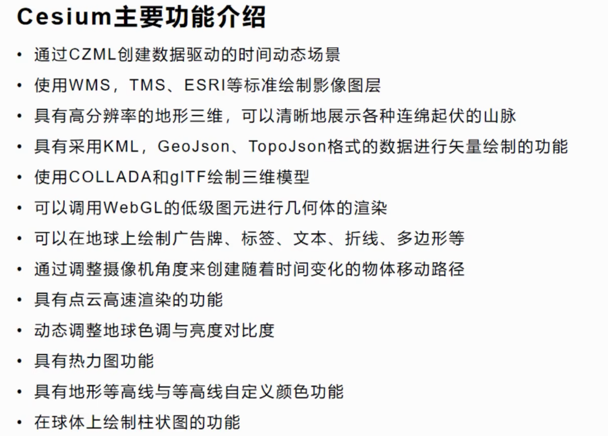

## 简介

- Cesium 是一个跨平台、跨浏览器的展示三维地球和地图的 javascript 库。
- Cesium 使用WebGL 来进行硬件加速图形，使用时不需要任何插件支持，但是浏览器必须支持WebGL。
- Cesium是基于Apache2.0 许可的开源程序。它可以免费的用于商业和非商业用途。



## 目录结构

- Source: Cesium应用程序代码及数据
- ThirdParty：外部依赖库，不同于Cesium的第三方库
- LICENSE.md：Cesium 的 License 介绍
- index.html：Web首页，需要按照Cesium要求定义页面，同时添加Cesium依赖库
- server.js：基于node.js的web服务应用

### 界面介绍

### 界面控件


### 隐藏控件

#### js代码控制

```javascript
var viewer = new Cesium.Viewer('cesiumContainer', {
    geocoder: false,  // 是否显示地名查找控件
    homeButton: false, // 是否显示主页按钮
    sceneModePicker: false, // 是否显示场景按钮
    baseLayerPicker: false,// 是否显示图层选择控件
    navigationHelpButton: false, // 导航帮助按钮
    animation: false, // 是否创建动画小器件，左下角仪表
    timeline: false, // 是否显示时间线控件
    creditContainer: "credit",
    fullscreenButton: false, // 是否全屏按钮
    vrButton: false,
    // skyBox : new Cesium.SkyBox({
    //     sources : {
    //     positiveX : 'stars/TychoSkymapII.t3_08192x04096_80_px.jpg',
    //     negativeX : 'stars/TychoSkymapII.t3_08192x04096_80_mx.jpg',
    //     positiveY : 'stars/TychoSkymapII.t3_08192x04096_80_py.jpg',
    //     negativeY : 'stars/TychoSkymapII.t3_08192x04096_80_my.jpg',
    //     positiveZ : 'stars/TychoSkymapII.t3_08192x04096_80_pz.jpg',
    //     negativeZ : 'stars/TychoSkymapII.t3_08192x04096_80_mz.jpg'
    //     }
    // })
});
```

关闭版权信息

```javascript
    // 去除cesium标识
mapViewer._cesiumWidget._creditContainer.style.display = 'none'
```

显示帧速（FPS）

```javascript
viewer.scene.debugShowFramesPerSecond = true;
```

#### css控制

```css
      /* 不占据空间，无法点击 */
.cesium-viewer-toolbar, /* 右上角按钮组 */
.cesium-viewer-animationContainer, /* 左下角动画控件 */
.cesium-viewer-timelineContainer, /* 时间线 */
.cesium-viewer-bottom /* logo信息 */
{
    display: none;
}

.cesium-viewer-fullscreenContainer /* 全屏按钮 */
{
    position: absolute;
    top: -999em;
}
```

## 主要类介绍

### `Viewer` 查看器


### `Scene` 场景类
所有3D对象的容器，隐式创建，可对基础地理环境进行设置

### `Primitive` 底层空间数据绘制方法

图形集合

```js
mapViewer.scene.primitives.add({})
```

`GroundPrimitive` 贴地

### `Entity` 实体类，由`Primitive`封装而来

Entity可以动态纹理
```js
const entity = viewer.entities.add({
    position: new Cesium.Cartesian3.fromDegress(116, 39),
    box: {
        dimensions: new Cesium.Cartesian3(4000.0, 3000.0, 5000.0),
        material: Cesium.Color.RED.withAlpha(0.5),
        outline: true,
        outlineColor: Cesium.Color.BLACK
    }
})
```

Primitive将形状和渲染解耦开来
```js
var primitive = CesiumViewerInstance.scene.primitives.add(new Cesium.Primitive({
    geometryInstances: linesInstances,
    appearance: new Cesium.PerInstanceColorAppearance({
        // flat : true,
        translucent : false,
        closed: true
    })
}))
```

### `DataSourceCollection` 数据源集合类

加载矢量数据的主要方式之一

CzmlDataSource(czml)，KmlDataSource(kml)，GeoJsonDataSource(geojson)

[topjson和geojson](https://www.jianshu.com/p/465702337744)

先加载`load`，再添加`add`

```js
viewer.dataSource.add(Cesium.GeoJsonDataSource.load('../data/data.topojson', {
    stroke: Cesium.Color.HOTPINK,
    fill: Cesium.Color.PINK.withAlpha(0.5),
    strokeWidth: 3,
}))
```

## 初始化

```js
const view = new Cesium.Viewer('containerId', {
})
```

## 绘制形状

### 通过Entity/实体添加形状

添加立方体

```javascript
var viewer = new Cesium.Viewer('cesiumContainer');
var redBox = viewer.entities.add({
    name: 'Red box with black outline',
    position: Cesium.Cartesian3.fromDegrees(119.040216, 33.58167, 50.9),
    box: {
        dimensions: new Cesium.Cartesian3(4000.0, 3000.0, 5000.0),
        material: Cesium.Color.RED.withAlpha(0.5),
        outline: true,
        outlineColor: Cesium.Color.BLACK
    }
});

viewer.zoomTo(viewer.entities);
```

### 通过czml添加

czml是一种JSON格式的字符串， 用于描述与时间有关的动画场景，czml包含点、线、地标、模型和其他的一些元素， 并指明了这些元素如何随时间而变化

```javascript
// czml加载/JSON字符串
const czml = [
    {
        id: 'document',
        name: 'box',
        version: '1.0'
    },
    {
        id: 'shape2',
        name: 'Red box with black outline',
        position: {
            cartographicDegrees: [119.040216, 33.58167, 50.9]
        },
        box: {
            dimensions: {
                cartesian: [4000.0, 3000.0, 5000.0]
            },
            material: {
                solidColor: {
                    color: {
                        rgba: [255, 0, 0, 128]
                    }
                }
            },
            outline: true,
            outlineColor: {
                rgba: [0, 0, 0, 255]
            }
        }
    }
]
const dataSourcePromise = Cesium.CzmlDataSource.load(czml)
mapViewer.dataSources.add(dataSourcePromise)
mapViewer.zoomTo(dataSourcePromise)
```

效果


### 形状类型

实体实例将多种形式的可视化聚集到单个高级对象中。可以手动创建它们并将其添加到 [Viewer＃entities](http://cesium.xin/cesium/cn/Documentation1.62/Viewer.html#entities)或由数据源，例如 [CzmlDataSource](http://cesium.xin/cesium/cn/Documentation1.62/CzmlDataSource.html)和 [GeoJsonDataSource](http://cesium.xin/cesium/cn/Documentation1.62/GeoJsonDataSource.html)。

| Name | Type | Description |
| --- | --- | --- |
| options | Object | optionalObject with the following properties: |
| Name | Type | Description |
| id | String | 可选此对象的唯一标识符。如果未提供，则将生成GUID。 |
| name | String | 可选显示给用户的可读名称。它不必是唯一的。 |
| availability | [TimeIntervalCollection](http://cesium.xin/cesium/cn/Documentation1.62/TimeIntervalCollection.html) | 可选与此对象相关联的可用性（如果有）。 |
| show | Boolean | 可选一个布尔值，指示是否显示实体及其子代。 |
| description | [Property](http://cesium.xin/cesium/cn/Documentation1.62/Property.html) | 可选一个字符串属性，用于为此实体指定HTML描述。 |
| position | [PositionProperty](http://cesium.xin/cesium/cn/Documentation1.62/PositionProperty.html) | 可选指定实体位置的属性。 |
| orientation | [Property](http://cesium.xin/cesium/cn/Documentation1.62/Property.html) | 可选指定实体方向的属性。 |
| viewFrom | [Property](http://cesium.xin/cesium/cn/Documentation1.62/Property.html) | 可选用于查看该对象的建议初始偏移量。 |
| parent | [Entity](http://cesium.xin/cesium/cn/Documentation1.62/Entity.html) | 可选与该实体关联的父实体。 |

| billboard | [BillboardGraphics](http://cesium.xin/cesium/cn/Documentation1.62/BillboardGraphics.html) | 可选与该实体相关联的广告牌。 |
| box | [BoxGraphics](http://cesium.xin/cesium/cn/Documentation1.62/BoxGraphics.html) | 可选与该实体关联的框。 |
| corridor | [CorridorGraphics](http://cesium.xin/cesium/cn/Documentation1.62/CorridorGraphics.html) | 可选与该实体关联的走廊。 |
| cylinder | [CylinderGraphics](http://cesium.xin/cesium/cn/Documentation1.62/CylinderGraphics.html) | 可选与该实体关联的圆柱体。 |
| ellipse | [EllipseGraphics](http://cesium.xin/cesium/cn/Documentation1.62/EllipseGraphics.html) | 可选与该实体关联的椭圆。 |
| ellipsoid | [EllipsoidGraphics](http://cesium.xin/cesium/cn/Documentation1.62/EllipsoidGraphics.html) | 可选与该实体关联的椭球。 |
| label | [LabelGraphics](http://cesium.xin/cesium/cn/Documentation1.62/LabelGraphics.html) | 可选与该实体关联的options.label。 |
| model | [ModelGraphics](http://cesium.xin/cesium/cn/Documentation1.62/ModelGraphics.html) | 可选与该实体关联的模型。 |
| path | [PathGraphics](http://cesium.xin/cesium/cn/Documentation1.62/PathGraphics.html) | 可选与该实体关联的路径。 |
| plane | [PlaneGraphics](http://cesium.xin/cesium/cn/Documentation1.62/PlaneGraphics.html) | 可选与该实体关联的平面。 |
| point | [PointGraphics](http://cesium.xin/cesium/cn/Documentation1.62/PointGraphics.html) | 可选与该实体关联的点。 |
| polygon | [PolygonGraphics](http://cesium.xin/cesium/cn/Documentation1.62/PolygonGraphics.html) | 可选与该实体关联的多边形。 |
| polyline | [PolylineGraphics](http://cesium.xin/cesium/cn/Documentation1.62/PolylineGraphics.html) | 可选与该实体关联的折线。 |
| properties | [PropertyBag](http://cesium.xin/cesium/cn/Documentation1.62/PropertyBag.html) | 可选与该实体关联的任意属性。 |
| polylineVolume | [PolylineVolumeGraphics](http://cesium.xin/cesium/cn/Documentation1.62/PolylineVolumeGraphics.html) | 可选与该实体相关联的polylineVolume。 |
| rectangle | [RectangleGraphics](http://cesium.xin/cesium/cn/Documentation1.62/RectangleGraphics.html) | 可选与该实体关联的矩形。 |
| wall | [WallGraphics](http://cesium.xin/cesium/cn/Documentation1.62/WallGraphics.html) | 可选与该实体关联的墙。 |

## 3D Tiles

### 什么是3D Tiles

`3DTiles`数据集是`cesium`小组`AnalyticlGraphics`于2016年3月定义的一种数据集，`3DTiles`数据集以分块、分级渲染， 将大数据量三维数据以分块，分层的形式组织起来，可以大量减轻浏览器和`GPU`
的负担是一个优秀的，并且格式公开的数据格式。

3D Tiles将用于流式传输3D内容，包括建筑物，树木，点云和矢量数据。

```javascript
const tileset = new Cesium.Cesium3DTileset({
    url: 'http://60.12.8.237:10082/shx3dtile/tileset.json',
});

viewer.scene.primitives.add(tileset);
viewer.zoomTo(tileset);

```

## 材质 Material

### MaterialProperty

设置材质

```javascript
//方法一，构造时赋材质
var entity = viewer.entities.add({
    position: Cesium.Cartesian3.fromDegrees(-103.0, 40.0),
    ellipse: {
        semiMinorAxis: 250000.0,
        semiMajorAxis: 400000.0,
        material: Cesium.Color.BLUE.withAlpha(0.5)//可设置不同的MaterialProperty
    }
});
//方法二，构造后赋材质
var ellipse = entity.ellipse;
ellipse.material = Cesium.Color.RED;
```

材质类型

#### ColorMaterialProperty - 颜色材质

颜色是最常见的材质，可以将几何形状修改为不同的纯色，达到区分的目的

```javascript
ellipse.material = Cesium.Color.BLUE.withAlpha(0.5)
```

#### ImageMaterialProperty - 图片

图片纹理功能比较丰富，主要有下面属性：

– image 值可以是URL，Canvas,或者Video
– repeat 值为一个二位数，分别表示X,y方向的重复次数，例如new Cartesian2(2.0, 1.0)表示x方向重复2次,y方向重复1次
– color 设置颜色之后，会在图片上覆盖一层设置的颜色
– transparent 是否透明，纹理为png图片的时候可以设置

```javascript
// 完整的这么写
ellipse.material = new Cesium.ImageMaterialProperty({
    image:'../images/cats.jpg',
    color: Cesium.Color.BLUE,
    repeat : new Cesium.Cartesian2(4, 4)
});

// 也可以简单的写成
ellipse.material = '../images/cats.jpg';
```

#### CheckerboardMaterialProperty - 棋盘纹理

共有三个属性

– evenColor 默认白色，棋盘的第一个颜色
– oddColor 默认黑色，第二个颜色
– repeat 重复次数

```javascript
ellipse.material = new Cesium.CheckerboardMaterialProperty({
  evenColor : Cesium.Color.WHITE,
  oddColor : Cesium.Color.BLACK,
  repeat : new Cesium.Cartesian2(4, 4)
});
```

#### StripeMaterialProperty - 条纹纹理

属性说明如下：
– evenColor 默认白色，棋盘的第一个颜色
– oddColor 默认黑色，第二个颜色
– repeat 条纹重复次数
– offset 偏移量
– orientation 水平或者垂直,默认水平

```javascript
ellipse.material = new Cesium.StripeMaterialProperty({
  evenColor : Cesium.Color.WHITE,
  oddColor : Cesium.Color.BLACK,
  repeat : 32,
  offset:20,
  orientation:Cesium.StripeOrientation.VERTICAL 
});
```

#### GridMaterialProperty - 网格

属性说明如下：
– color 网格颜色
– cellAlpha 单元格透明度
– lineCount 行列个数
– lineThickness 线粗细
– lineOffset 线偏移

```javascript
ellipse.material = new Cesium.GridMaterialProperty({
  color : Cesium.Color.YELLOW,
  cellAlpha : 0.2,
  lineCount : new Cesium.Cartesian2(8, 8),
  lineThickness : new Cesium.Cartesian2(2.0, 2.0)
});
```

#### PolylineGlowMaterialProperty - 发光线

属性说明如下：
– color 发光的颜色(中心颜色为白色)
– glowPower 发光的长度，值为线宽的百分比(0~1.0)

```javascript
polyline.material = new Cesium.PolylineGlowMaterialProperty({
    glowPower : 0.2,
    color : Cesium.Color.BLUE
});
```

#### PolylineOutlineMaterialProperty - 线纹理

属性说明如下：
– color 线的颜色
– outlineWidth 线纹理宽度
– outlineColor 线纹理颜色

```javascript
polyline.material = new Cesium.PolylineOutlineMaterialProperty({
    color : Cesium.Color.ORANGE,
    outlineWidth : 3,
    outlineColor : Cesium.Color.BLACK
});
```

## 实体 Entity

### 实体属性

#### Entity的各个属性

* id<br>
唯一标志，如果没设置，值就为一个默认给定的GUID<br>
* name<br>
名称，可以不唯一<br>
* availability<br>
可用性<br>
* show<br>
可见性<br>
* description<br>
描述<br>
* position<br>
位置<br>
* orientation<br>
方向<br>
* viewFrom<br>
查看此对象的初始偏移量<br>
* parent<br>
父节点<br>
* properties<br>
与此实体关联的任意属性。<br>
* Graphics<br>

#### 相关的形状

– box<br>
– corridor<br>
– cylinder<br>
– ellipse<br>
– ellipsoid<br>
– path<br>
– point<br>
– polygon<br>
– polyline<br>
– polylineVolume<br>
– rectangle<br>
– wall<br>
– billboard<br>
– label<br>
– model</p>

##### 标签 label

文字标注,可以设置样式，文字内容，字体，偏移等等

```js
{
    text: 'Citizens Bank Park',
    font: '14pt monospace',
    style: Cesium.LabelStyle.FILL_AND_OUTLINE,
    outlineWidth: 2,
    verticalOrigin: Cesium.VerticalOrigin.BOTTOM,
    pixelOffset: new Cesium.Cartesian2(0, -9)
}
```

##### 模型 model

常见的模型有`glTF`和`glb`

```javascript
model: {
    uri : '../../SampleData/models/CesiumGround/Cesium_Ground.gltf'
}
```

##### 广告牌 billboard

一个最简单的广告牌一般就是图片，和显示大小
```javascript
billboard : {
  image: 'http://localhost:81/images/2015/02-02/Philadelphia_Phillies.png',
  width: 64,
  height: 64
}
```

### 实体操作

#### 增

创建实体

```javascript
//方法一
var entity = new Entity({
    id : 'uniqueId'
});
viewer.entities.add(entity);

//方法一 简写
viewer.entities.add({
    id : 'uniqueId'
});

//方法二
var entity = viewer.entities.getOrCreateEntity('uniqueId');
```

#### 查

```javascript
var entity = viewer.entities.getById('uniqueId');
```

#### 删

```javascript
//方法一，先查后删
var entity = viewer.entities.getById('uniqueId');
viewer.entities.remove(entity) 
//方法二，直接删除
viewer.entities.removeById('uniqueId')
//方法三，删除所有
viewer.entities.removeAll()
```

#### 实体集变化

```javascript
function onChanged(collection, added, removed, changed){
  var msg = 'Added ids';
  for(var i = 0; i < added.length; i++) {
    msg += '\n' + added[i].id;
  }
  console.log(msg);
}
viewer.entities.collectionChanged.addEventListener(onChanged);
```

## Imagery

关键元素：图层（Imagery）

**支持的图层格式：**

- wms
- TMS
- WMTS (with time dynamic imagery)
- ArcGIS
- Bing Maps
- Google Earth
- Mapbox
- OpenStreetMap

## Terrain

地形（Terrain）

Cesium支持流式的、可视化的全球高程投影地形地势、水形数据，包括海洋、湖泊、河流、山峰、峡谷和其他能够被三维展示出来的且效果比二维好的地形数据。像图层数据一样，Cesium引擎会从一个服务器上请求流式地形数据，仅请求那些基于当前相机能看到的需要绘制的图层上的数据。

Cesium官方提供了一些地形数据集的例子，以及如何配置这些参数。

- ArcticDEM : 高投影的arctic terrain
- PAMAP Terrain : 高投影的Pennsylvania terrain
- Terrain display options : 一些地形数据配置和格式
- Terrain exaggeration : 是地形间的高度差异更加的优雅艺术

支持的地形数据格式

- Quantized-mesh, Cesium团队自己开源的一种格式
- Heightmap
- Google Earth Enterprise

## Scene

视窗（Scene）

### 基础的Cesium类型

- Cartesian3 : 一个三维笛卡尔坐标——当它被用作相对于地球中心的位置时，使用地球固定框架（ECEF）。
- Cartographic : 由经度、纬度（弧度）和WGS84椭球面高度确定的位置。
- HeadingPitchRoll : 在东北向上的框架中关于局部轴的旋转（弧度）。航向是围绕负Z轴的旋转。俯仰是围绕负Y轴的旋转。滚动是关于正X轴的旋转。
- Quaternion :以4D坐标表示的3D旋转。 

## camera控制
setView，flyto，lookAt
共同参数：roll【x轴】，pitch【y轴】，heading【z轴】

### setView

- Cartesian3方式

```js

view.camera.setView({
    destination: Cesium.Cartesian3.fromDegrees(116.435314, 39.960521, 15000.0), // 设置位置
    orientation: {
        heading: Cesium.Math.toRadians(20.0), // 方向
        pitch: Cesium.Math.toRadians(-90.0),// 倾斜角度
        roll: 0
    }
});
```

- Rectangle方式

```js
view.camera.setView({
    destination: Cesium.Rectangle.fromDegrees(0.0, 20.0, 10.0, 30.0),//west, south, east, north
    orientation: {
        heading : Cesium.Math.toRadians(20.0), // 方向
        pitch : Cesium.Math.toRadians(-90.0),// 倾斜角度
        roll : 0
    } 
});
```

### flyto

```js
view.camera.flyTo({
    destination: Cesium.Cartesian3.fromDegrees(116.435314, 39.960521, 15000.0), // 设置位置
    orientation: {
        heading: Cesium.Math.toRadians(20.0), // 方向
        pitch: Cesium.Math.toRadians(-90.0),// 倾斜角度
        roll: 0
    },
    duration: 5, // 设置飞行持续时间，默认会根据距离来计算
    complete: function () {
        // 到达位置后执行的回调函数
    },
    cancle: function () {
        // 如果取消飞行则会调用此函数
    },
    pitchAdjustHeight: -90, // 如果摄像机飞越高于该值，则调整俯仰俯仰的俯仰角度，并将地球保持在视口中。
    maximumHeight: 5000, // 相机最大飞行高度
    flyOverLongitude: 100, // 如果到达目的地有2种方式，设置具体值后会强制选择方向飞过这个经度(这个，很好用)
});
```

### lookAt

```js
var center = Cesium.Cartesian3.fromDegrees(114.44455, 22.0444); //camera视野的中心点坐标
var heading = Cesium.Math.toRadians(50.0);
var pitch = Cesium.Math.toRadians(-20.0);
var range = 5000.0;
view.camera.lookAt(center, new Cesium.HeadingPitchRange(heading, pitch, range));
```

## CallbackProperty使用

> 一个 Property ，其值由回调函数延迟计算。

包含两个参数

callback	`CallbackProperty.Callback`	评估属性时要调用的函数。
isConstant	Boolean	每次回调函数返回相同值时，为 `true` ，如果值将更改，则为 `false`。[是否返回相同的值]


## 常见效果

### 轨迹漫游

[http://localhost:30001/Cesium](http://localhost:30001/Cesium)


### 贴地线


### 热力图


### 雷达图


### 鹰眼实现

创建一个小的三维球
禁止缩放
主视图变化，鹰眼也变化

```js
//1.创建双球
var viewer = new Cesium.Viewer('cesiumContainer', {});
var viewer1 = new Cesium.Viewer('eye', {});

//2.设置鹰眼图中球属性
let control = viewer1.scene.screenSpaceCameraController;
control.enableRotate = false;
control.enableTranslate = false;
control.enableZoom = false;
control.enableTilt = false;
control.enableLook = false;
let syncViewer = function() {
    viewer1.camera.flyTo({
        destination: viewer.camera.position,
        orientation: {
            heading: viewer.camera.heading,
            pitch: viewer.camera.pitch,
            roll: viewer.camera.roll
        },
        duration: 0.0
    });
};

//3.同步
// viewer.camera.changed.addEventListener(syncViewer);//卡顿，失败
// viewer.scene.preRender.addEventListener(syncViewer);//谢谢木遥告知，如果添加这个事件监听，效果和第三种方式一样，成功

// 使用回调CallbackProperty
viewer.entities.add({
    position : Cesium.Cartesian3.fromDegrees(0, 0),
    label: {
        text: new Cesium.CallbackProperty(function(){
            syncViewer();
            return "";
        }, true)
    }
});

```
